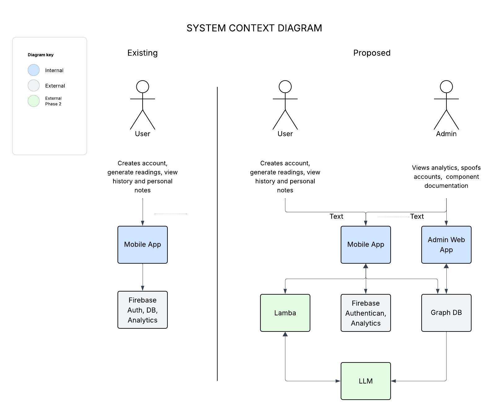
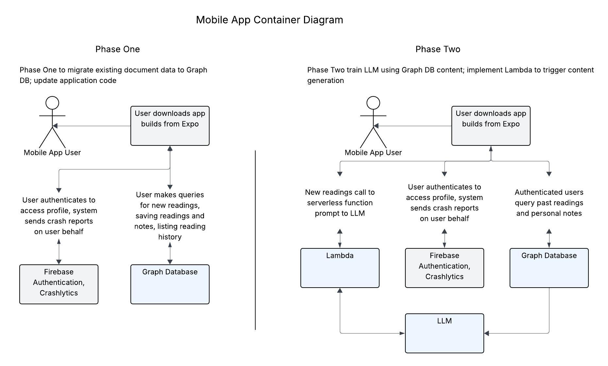
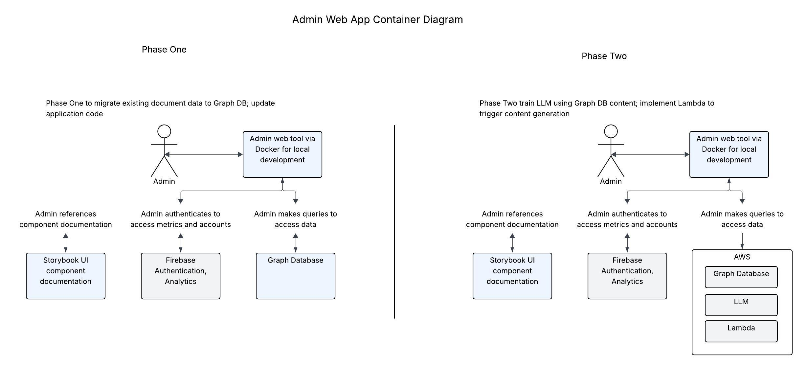
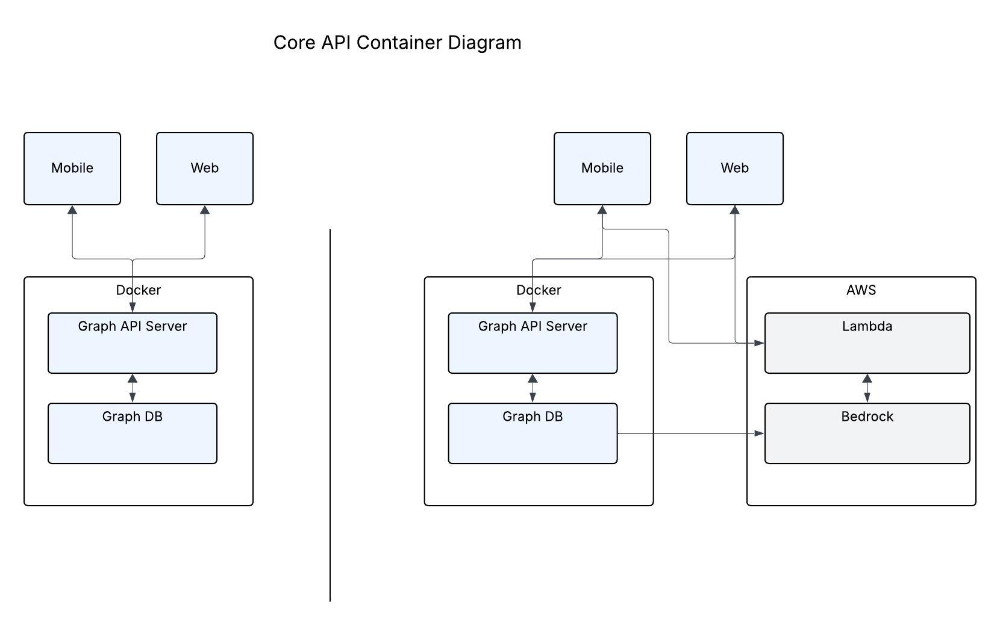

# Simple Tarot Project Spec

## Overview

Simple Tarot is a tarot card reading app that is a rebuild of an [existing application](https://github.com/avacollins/tarot-ix) in order to expand content generation using an LLM.

##  Software System

### System Context

#### System Users

- **User** — Users query the tarot cards and generate a reading, save readings and take notes

- **Admin System** — Admins manage and gain insights into usage and performance of the Simple Tarot application

#### External Systems

- **Cloud Services** - Firebase, Graph DB, Bedrock, Lambda, Expo

#### System Context Diagram

### System Containers

- **User Facing Mobile App** — React Native for iOS and Android

- **Admin Only Web App** - React Native Web, Next, Storybook UI, Docker

- **Core API** — Graph DB (undecided implementation), LLM Foundation Model (undecided), Bedrock, Lambda

#### Container Diagram

##### Mobile App

##### Admin App

##### Core API

## Simple Tarot Mobile and Web Application

### UI Designs

[Existing mobile UI](./assets/existing_ui.png)

- Will be leveraging existing application layouts for readings and profile

- History and notes screens need to be redsigned

- Storybook UI will leveraged as component documentation and CMS to create and update graph models in tandem with UI

- Admin application needs full design

### Functional Requirements

#### User Experience

- Mobile first design, universal render for web

#### Authentication

- Users can create an account using email, phone number, or anonymously
- Users can authenticate using their created account credentials
- Authenticated users can update their profile information
- Authenticated users can reset their passwords if forgotten

#### Readings

- Users can get one new reading a day

- Users can save their readings and add notes

#### History

- Users can revisit past readings and notes

#### Admin Experience

- Application can be launch from Docker container

- Access to Graph DB

- Access to analytics and crash reports

- Access to shared component library and UI documentation

- Ability to trigger Lambda

## Architectural Documents

👉🏽 Check out 
 
 - [requirements](./docs/requirements.md)
 
 - [architectural decisions](./docs/adr.md)

 - [domain model with class diagram](./docs/domain_model.md)

 - [sequence diagrams](./docs/sequence_diagrams.md)

 # Copyright

The [Rider Waite](https://sacred-texts.com/tarot/faq.htm#uscopyright) cards used in this application are in the public domain; svg pictorial keys were obtained under [Creative Commons](https://creativecommons.org/publicdomain/zero/1.0/) open source licensing.

The code in this repository is open for personal use but not for distributing.