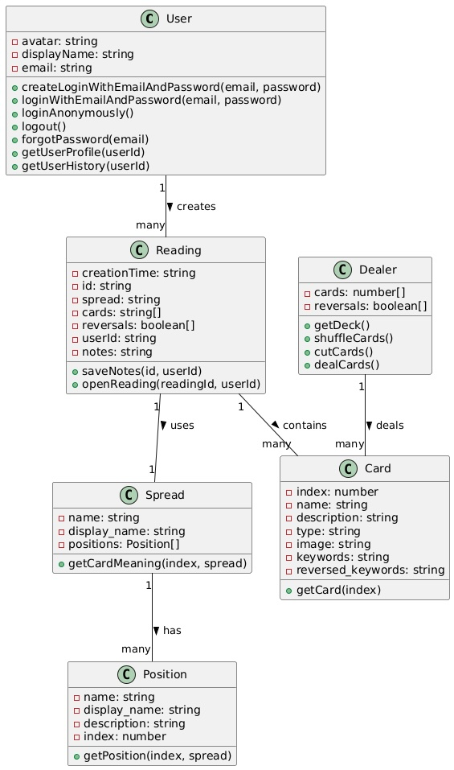

# Domain Model

## Entities

- `User`
- `Dealer`
- `Card`
- `Spread`
- `Positions`
- `Reading`

## Attributes and Operations

### `User`

- avatar: string
- displayName: string
- email: string
- `createLoginWithEmailAndPassword(email, password)`
- `loginWithEmailAndPassword(email, password)`
- `loginAnonymously()`
- `logout()`
- `forgotPassword(email)`
- `getUserProfile(userId)`
- `getUserHistory(userId)`

### `Dealer`

- cards: number[]
- reversals: boolean[]
- `getDeck()`
- `shuffleCards()`
- `cutCards()`
- `dealCards()`

### `Card`

- index: number
- name: string
- description: string
- type: string
- image: string
- keywords: string
- reversed_keywords: string
- `getCard(index)`

### `Spread`

- name: string
- display_name: string
- positions: Position[]
- `getCardMeaning(index, spread)`

### `Position`

- name: string
- display_name: string
- description: string
- index: number
- `getPosition(index, spread)`

### `Reading`

- creationTime: string
- id: string
- spread: string
- cards: string[]
- reversals: boolean[]
- userId: string
- notes: string
- `saveNotes(id, userId)`
- `openReading(readingId, userId)`

## Class Diagram

