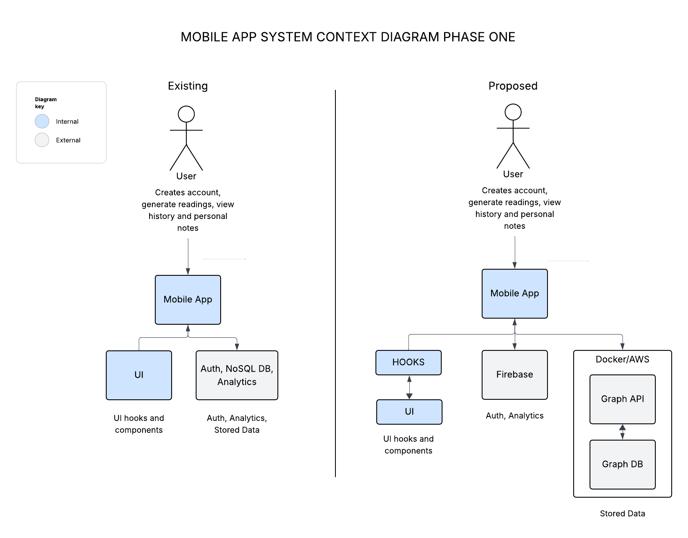
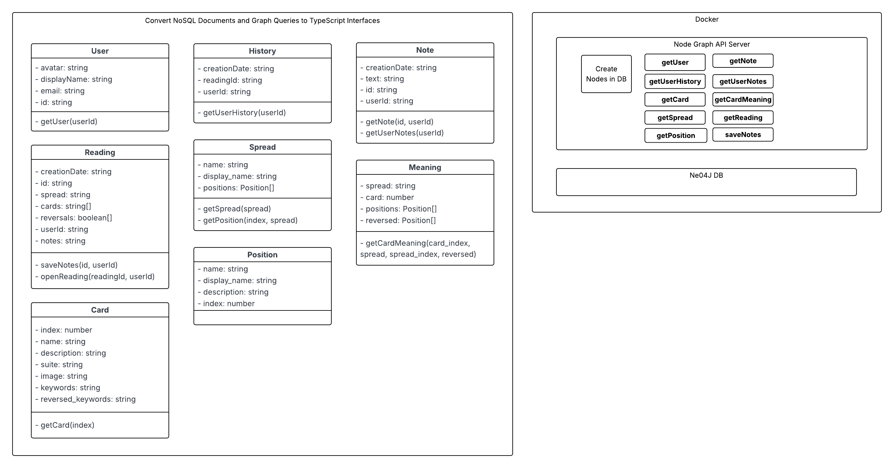

# Simple Tarot Mobile App Design Doc Phase One

## 1. Overview

This document outlines the high-level architecture design for Simple Tarot's user-facing mobile application.

Simple Tarot aims to rebuild its current prototype application in order to incorporate generative AI into the backend to create more engaging content for the end user over time. 

This design document addresses the architectural requirements, provides a high-level design, considers alternatives, and outlines a timeline for implementation of the first phase of the rebuild which is focused on laying the foundation of the system as a whole.

## 2. Context

Simple Tarot's prototype application has defined the overall application functionality but the code organization does not lend itself to expansion.

The end goal is to rebuild the system backend to support phase two LLM integrations.

Technical goals for phase one are to design a new architecture that is scalable, modular, and maintainable, allowing new features to built up from the existing core over time. 

## 3. Goals and Non-Goals

### Goals

- **Scalability**: Design an architecture that can support a growing set of use cases for AGI
- **Modularity**: Ensure the codebase is modular to allow rapid iterations of different core areas autonomously
- **Maintainability**: Automated code quality tools for enforcing code styles i.e. TS build, ESLint, Conventional Commits, etc.

### Non-Goals

- **UI Design**: This project focuses on the application code organization and backend architecture at this time
- **Admin Web App Development**: The scope is limited to the mobile application, the admin app will have it's own design document
- **AGI**: Phase two will have it's own design document

## 4. High Level Design

The mobile application rebuild will continue to be a yarn workspace monorepository with all components documented using Storybook UI. Existing code base will be refactored to support a universal application render on both mobile and web. 

Phase One will include 
- Restructure of mobile routing using Expo file based router
- Migration of NoSQL database to Graph DB
- UI packages to adhere to atomic design principles where ui is built up from atoms, molecules, organisms, templates and screens

### Container Diagrams

### Architectural Style

- **Component-Based Architecture**: Utilize Storybook UI to create a component library using React Native
- **Monorepo**: Develop our frontend apps and packages in a monorepo to speed up development and remove friction when sharing code
- **TypeScript**: Use TypeScript for type safety and better developer experience
- **Graph API**: Use GraphQL library to query DB via node server

### Key Components

1. **Home Screen**: Initial screen after authentication with main application menu

2. **Auth Screen**: Manages user registration, login, and password reset

3. **Account Screen**: Display user information, logout

4. **History Screen**: Display user reading history navigate to reading

5. **Reading Screen**: Initiates new reading

6. **Shuffle Screen**: Runs the shuffle and cut animation

7. **Deal Screen**: Displays reading results in spread layout

8. **Reading Detail Screen**: Displays reading detail text for each card in a carousel

9. **Note Screen**: Saves and displays user saved notes for reading

### Technology Stack

- **Frontend**: React Native, TypeScript, Redux, Storybook UI
- **Backend**: Node, Neo4J
- **Deployment**: Docker, AWS, Expo

## 5. Alternatives Considered

1. **Apollo DB**: Neo4J best suited for future needs
2. **Auroa DB deployment**: AWS container deployment also suites future requirements better

## 6. Timeline

### Phase 1: Discovery and Planning (May 2025 - June 2025)

- Finalize requirements and gather detailed specifications
- Design the architecture and create detailed technical documentation

### Phase 2: Initial Development (June 2025 - July 2025)

- Set up yarn workspace and application file based routing
- Create UI packages using Storybook UI
- Migrate data and client libraries to use Neo4J
- Implement UI screens into application code

### Phase 4: Testing and Deployment (August 2025)

- Perform comprehensive end-to-end testing
- Deploy Graph DB to AWS
- Deploy App to EAS

## 7. Risks and Open Questions

### Risks

- **Time**: Finding a fulltime job would affect the output of this project 

- **Money**: Hosting on AWS may be too expensive to maintain

### Open Questions

- **Profile Enhancement**: Should change email function be added now or later when it presents a need

## 8. Appendix

### References

 - [requirements](./docs/requirements.md)
 
 - [architectural decisions](./docs/adr.md)

 - [domain model with class diagram](./docs/domain_model.md)

 - [sequence diagrams](./docs/sequence_diagrams.md)
