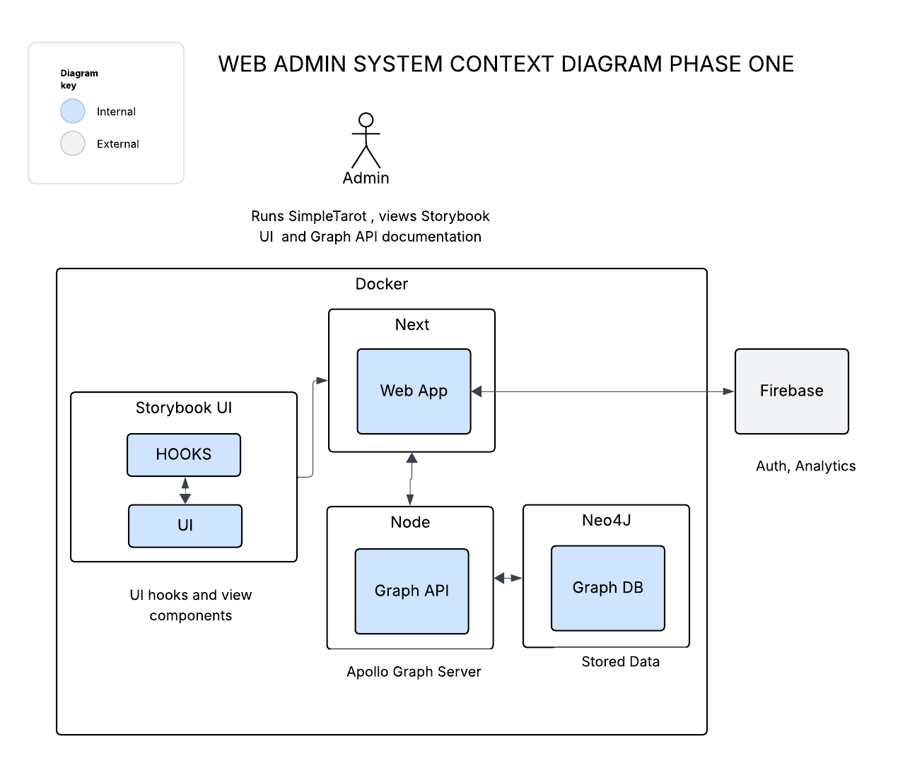
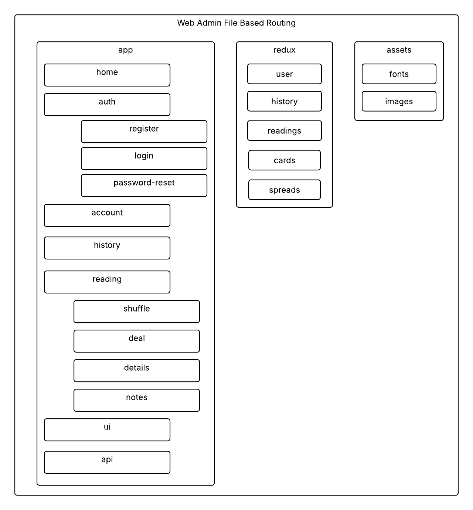

# Simple Tarot Web Design Doc Phase One

## 1. Overview

This document outlines the high-level architecture design for Simple Tarot's administration web application.

This design document addresses the architectural requirements, provides a high-level design, considers alternatives, and outlines a timeline for implementation of the first phase of the web admin.

## 2. Context

The web admin application is a new application introduced as a way to Dockerize the various systems into a single configuration that can be deployed or developed locally.

The end goal is to have a web application that depends on the same UI components and routing structure as the mobile app, include a route for Storybook UI, and a route for API Mapping Tool (i.e. GraphQL Playground).

Technical goals for phase one are to design a new architecture that is maintainable, reliable and agile allowing new features to be built up from the existing core over time. 

## 3. Goals and Non-Goals

### Goals

- **Maintainability**: Graph API playground and Storybook UI documentation
- **Reliability**: Automated testing on GitHub actions
- **Agility**: Dockerize all application to be orchestrated via configurations and docker commands

### Non-Goals

- **Firebase Analytics Integration**: Will not be included in this iteration, a link to the console will be on the Home screen menu
- **Mobile Application**: Focusing on web admin development

## 4. High Level Design

All tarot screens will be the same screens used on mobile app wrapped in a web template for fixed layout. The web admin will be using file based routing to best mirror deep link parity between mobile and web. [Apollo GraphQL Playground](https://www.apollographql.com/docs/graphos/connectors/tooling/mapping-playground) exposed as a route for query development. Storybook UI build exposed as a route for component reference.

Phase One will include 
- Structure of the file based routing, to mirror mobile app for tarot deep links
- Automate publishing storybook builds to web admin for UI documentation route (GH Actions)
- Implement Apollo Server Mapping Playground into route for API management
- Dockerize all apps and orchestrate

### Container Diagrams

### Architectural Style

- **Micro Frontend Architecture**: Add builds from Storybook and Apollo GraphQL Mapping Tool as routes
- **Docker**: Containerize all apps to be run together with single command
- **State Hooks**: Use shared hooks to create application using Redux Toolkit

### Key Components

1. **Next Routing Module**: Initial Next setup with file based routing implemented to match mobile

2. **UI Module**: The core user interface library for both mobile and web applications build and deployed via GH actions

3. **Hooks Module**: Universal data providers for the UI

4. **Neo4J Module**: Graph DB and API server containerized for composition

### Technology Stack

- **Frontend**: React Native, TypeScript, Redux, Storybook UI, Next
- **Backend**: Node, Neo4J
- **Deployment**: Docker

## 5. Alternatives Considered

## 6. Timeline

### Phase 1: Discovery and Planning (June 2025)

- Finalize requirements and gather detailed specifications
- Design the architecture and create detailed technical documentation

### Phase 2: Initial Development (June 2025 - July 2025)

- Implement application file based routing
- Implement UI screens into web templates
- Create Build action for Storybook UI to auto deploy latest to admin static files
- Orchestrate Docker files to run together

### Phase 4: Testing and Deployment (July 2025)

- Automate testing
- No deployments at this time

## 7. Risks and Open Questions

### Risks

- **Time**: Finding a fulltime job would affect the output of this project 

### Open Questions

- **Test**: Frameworks TBD

- **Versioning**: Conventional Commits with Semantic release
